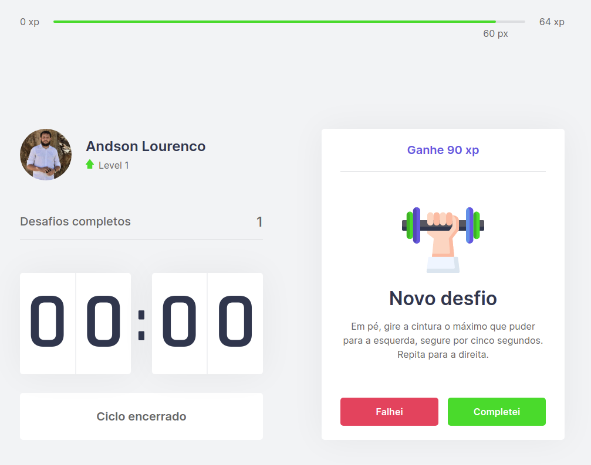

# This is a simple Pomodoro

project developed at NLW

## stack 

```
- react
- nextJS
- typescript
- css-module
```

## Iniciando projeto

Start by cloning the project.

installing the dependencies.

```
 yarn 
```

starting the project.

```
yarn dev 
```

## Prévia

